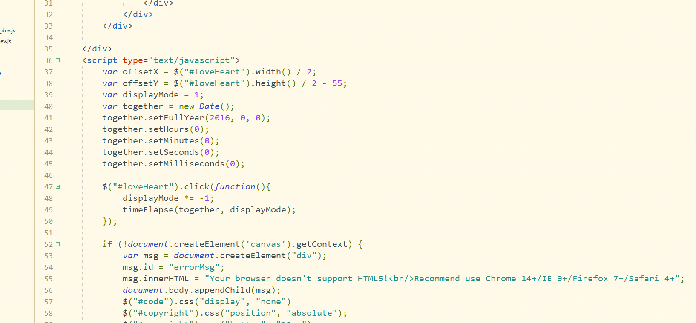

loveTimeline
============

# 记录你的爱情时光轴
[Demo Website](http://www.sivan.tech/LoveTimeLine/)

## 使用说明
* 1. clone 到本地
* 2. 修改表白日期，打开项目文件夹，修改index.html 42 行代码 		
>	together.setFullYear(2015, 1, 13); 
2015 表示 2015年
1 表示 2月，如果表示5月，改为4，
同理13表示14号，以此类推
* 3. 如果要修改内容，请按照html语法标准在index.html进行修改

----------------
如果你觉得项目很好，不防给个star鼓励

